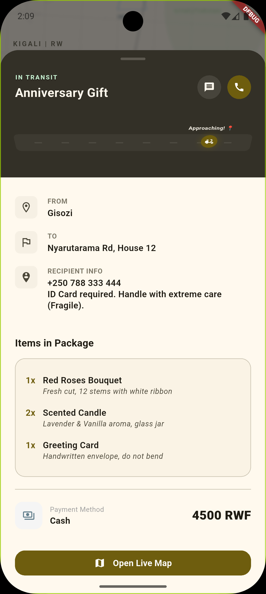
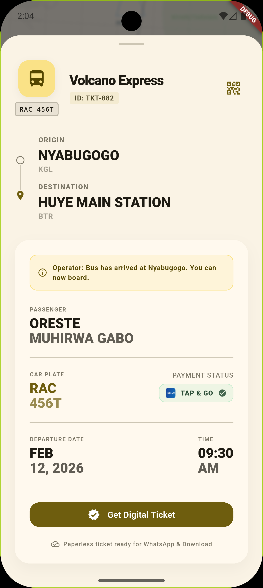
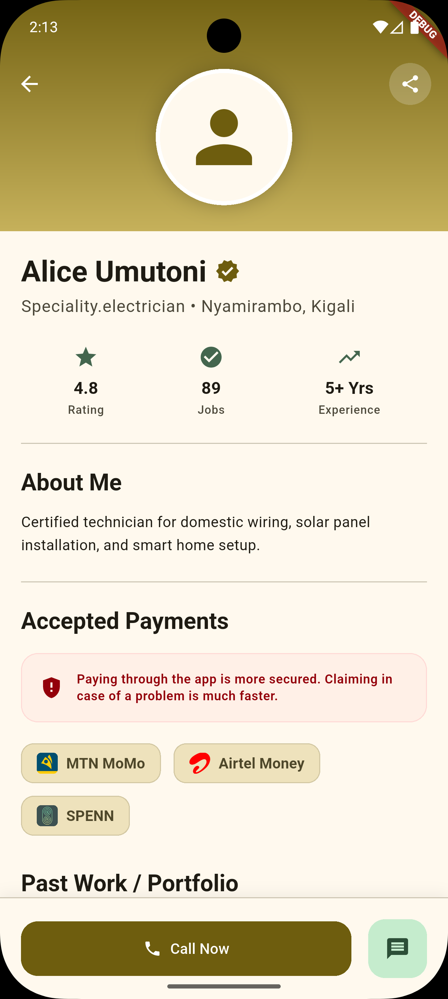
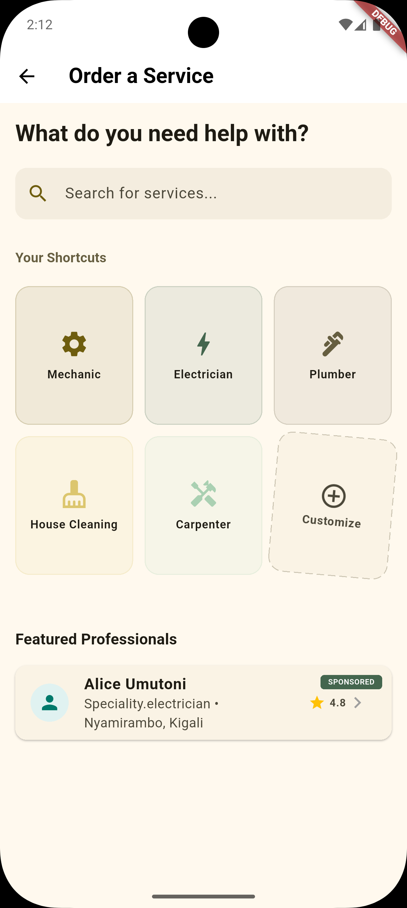
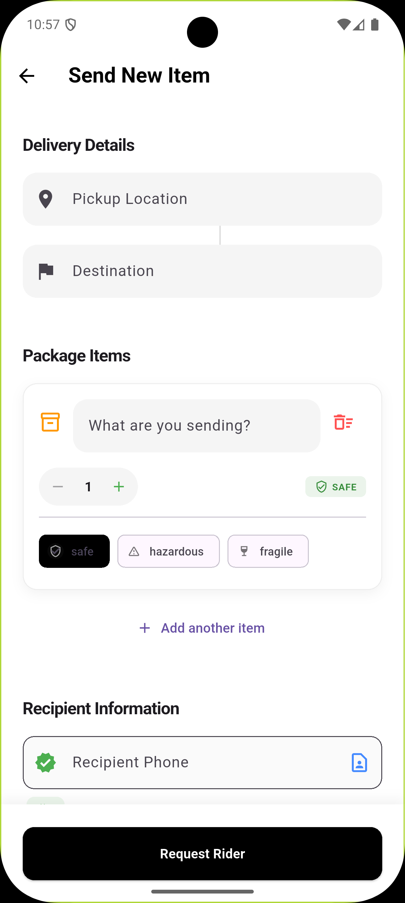

# KGL Express 🇷🇼
> **Your City, Delivered & Connected — Safe, Smart, and Fast.**

[](https://flutter.dev)
[](LICENSE)
[](https://www.openstreetmap.org)
[](https://sqlite.org)

⚠️ This project is proprietary. No reuse or duplication is permitted without explicit written permission.
---

## 📍 Overview

**KGL Express** is a high-performance logistics and transport platform designed specifically for the urban environment of **Kigali, Rwanda**.

<p align="center">
  
  
  
</p>

---

## 📱 App Experience

### 🔐 Onboarding & Profile
Seamless entry into the ecosystem with specialized roles and personal data management.
<p align="center">
  
  
</p>

### 📦 Logistics & Service Selection
Advanced service discovery and order creation with intelligent category splitting.
<p align="center">
  
  
  
</p>

### 🎥 Experience it in Action
[**Watch the Demo Video**](screenshots/demo.webm)

Built with **Flutter** and **OpenStreetMap**, it provides a scalable delivery and transport solution for **local sellers, bus operators, moto-couriers, and customers** — without relying on expensive proprietary map APIs.

---

## 🚀 Why KGL Express?

- **Zero API Costs**  
  Uses OpenStreetMap and `flutter_map` with local SQLite tile caching (`kigali_map.db`), avoiding Google Maps fees.

- **Smart Package Logic**  
  Automatically categorizes and splits orders (Food, Clothes, Toxic Liquids) to ensure safety and hygiene during moto-dispatch.

- **Inter-City Connectivity**  
  Beyond parcels, it handles digital bus ticketing with live operator updates and car-plate tracking.

- **Built for Kigali**  
  Optimized for local constraints with offline fallbacks, Tap & Go integration, and MoMo/Airtel support.

---

## 🛠️ Key Features

### 📦 For Senders & Sellers
- **Intelligent Order Splitting:** Automated safety rules for vehicle matching.
- **Bulk Entry:** Easily add multiple items per delivery request.
- **Service Selection:** Toggle between logistics providers and public transport operators.

### 🚌 For Passengers
- **Digital Tickets:** Modern boarding passes with Data Matrix codes and marquee-animated long names.
- **Live Boarding Status:** Real-time messages from bus operators (e.g., "Bus has arrived at Nyabugogo").
- **Car Plate Tracking:** Quickly identify your bus in a crowded station via `RAC***` plate highlights.

### 🛵 For Moto-Cyclists & Drivers
- **Offline Maps:** Custom rendering using `osm_parser` and `kigali_map_painter`.
- **Live Dispatch:** Real-time order requests and acceptance flow.
- **GPS Reliability:** Continuous background location updates using `geolocator`.

---

## 🧠 System Architecture

KGL Express follows a **feature-first, modular Flutter architecture**:

- **Platform UI Factory:** Custom `UIFactory` pattern for native-feeling Android and iOS components.
- **Feature Isolation:** Auth, Map, Sender, and Driver flows are decoupled for independent scaling.
- **Local Persistence:** SQLite storage for maps and activity history, ensuring reliability in low-data areas.

---

## 🏗️ Tech Stack

- **Frontend:** Flutter (Dart)
- **Mapping:** OpenStreetMap (`flutter_map`), `latlong2`
- **Database:** SQLite (`sqflite`) for map tiles (`.db`) and local storage
- **Routing:** OpenRouteService (ORS) API / Offline OSM Parsing
- **Payments:** MTN MoMo, Airtel Money, BK Pay, SPENN, Tap & Go

---

## 📁 Project Structure

```text
.
├── assets/
│   ├── icons/              # Payment logos (MoMo, BK, Tap&Go, etc.)
│   ├── kigali_map.db       # Offline SQLite map tiles
│   └── map1.osm            # Raw OpenStreetMap data
├── lib/
│   ├── core/
│   │   ├── enums/          # PaymentMethod, OrderStatus, ProviderType
│   │   ├── presentation/   # UIFactory (Android/iOS) & PlatformUI
│   │   ├── services/       # GPS, Map, and Contact Services
│   │   └── theme/          # AppTheme (Deep Orange & Teal)
│   ├── features/
│   │   ├── auth/           # Onboarding & Role Selection
│   │   ├── driver/         # Live Map & Order Requests
│   │   ├── map/            # OSM Parser & Database Helper
│   │   ├── receiver/       # Incoming delivery confirmation
│   │   └── sender/         # Home, Draggable Activity Panel, & Ticket Sheets
│   ├── models/             # OrderModel, PackageModel, BusTicketModel
│   └── main.dart           # App Entry Point
└── screenshots/            # README Media
```

---

## 🏁 Getting Started

### Clone the repository
```bash
git clone https://github.com/OresteGabo/kgl_express.git
cd kgl_express
```

### Install dependencies
```bash
flutter pub get
```

### Run the app
```bash
flutter run
```

---

## 🤝 Contributing

Contributions are welcome!

If you’re familiar with **Flutter**, **GIS/Mapping**, or **Kigali’s transport ecosystem**, feel free to open an issue or submit a pull request.

---

## ❤️ Built for the community of Kigali

**Let’s keep the city moving.**
